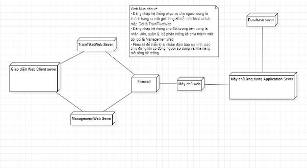

**BỘ GIÁO DỤC VÀ ĐÀO TẠO**

**TRƯỜNG ĐẠI HỌC THỦY LỢI**

**KHOA CÔNG NGHỆ THÔNG TIN**

**BÁO CÁO CHUYÊN ĐỀ HỌC PHẦN**

**PHÂN TÍCH VÀ THIẾT KẾ HỆ THỐNG THÔNG TIN**

**ĐỀ TÀI**: **THIẾT KẾ WEBSITE ĐẶT VÉ**

` `2151160525 - Nguyễn Văn Nam 

` `2151160499 - Đỗ Hữu Thịnh 

` `2151163729 - Nguyễn Thị Thơm (NT)

` `2151163731 - Đỗ Thị Thương 

`                      `Lớp: 63HTTT1

`                      `Niên khóa: 2021-2025

`                      `Giảng viên hướng dẫn:  Nguyễn Ngọc Quỳnh Châu

`	`*Hà Nội, ngày 06 tháng 03 năm 2023*

# **LỜI MỞ ĐẦU**

Hệ thống thông tin là một trong những ngành mang tính tất yếu của nền kinh tế thời đại. Với sự hỗ trợ của công nghệ, sự bùng nổ các thiết bị kết nối internet, doanh nghiệp ngày càng có cơ hội mở rộng kênh bán hàng, tiếp thị sản phẩm đến người tiêu dung. Các website ra đời đã góp phần quan trọng và đóng góp to lớn trong việc thúc đẩy kinh doanh phát triển nhanh chóng, các sản phẩm, dịch vụ đến gần hơn với khách hàng. Đặc biệt các website đặt vé di chuyển ngày càng được xây dựng nhiều hơn.

Với mong muốn xây dựng một hệ thống đặt, xem vé trên website tiện lợi và giúp người dùng dễ dàng sử dụng nhất. Chúng em đã thực hiện đề tài “Thiết kế website đặt vé”. Chúng em tin tưởng rằng đây sẽ là một đề tài rất bổ ích và có thể đem lại giá trị không nhỏ cho nhiều công ty du lịch lữ hành, vận chuyển.

Bài báo cáo gồm những nội dung chính sau:

Chương 1: Tổng quan về đề tài

Chương 2: Phân tích hệ thống

Chương 3: Thiết kế hệ thống

Chương 4: Giao diện thử nghiệm

# **LỜI CẢM ƠN**
Trên thực tế không có sự thành công nào mà không gắn liền với những sự hỗ trợ, giúp đỡ dù ít hay nhiều, dù trực tiếp hay gián tiếp của người khác. Trong suốt thời gian đã và đang học tập tại trường đến nay, nhóm chúng em đã nhận được rất nhiều sự quan tâm, giúp đỡ của quý Thầy Cô, gia đình và bạn bè.

` `Và đặc biệt, trong học kỳ này, chúng em xin cảm ơn cô Nguyễn Ngọc Quỳnh Châu đã hướng dẫn, góp ý, thảo luận để bài báo cáo này được hoàn thiện. Dưới sự hướng dẫn của cô, chúng em không những tiếp thu được rất nhiều kiến thức bổ ích, mà còn được truyền sự say mê, thích thú với bộ môn Phân tích và Thiết kế Hệ thống thông tin.

Mặc dù đã rất cố gắng hoàn thiện bài báo cáo với tất cả sự nỗ lực, nhưng, do bước đầu đi vào thực tế, tìm hiểu và xây dựng hệ thống trong thời gian có hạn, với số lượng kiến thức còn hạn chế, nên đề tài: “THIẾT KẾ WEBSITE ĐẶT VÉ” chắc chắn sẽ không thể tránh khỏi những thiếu sót. Chúng em rất mong sẽ nhận được sự quan tâm, thông cảm và những đóng góp quý báu của các thầy cô và các bạn để bài báo cáo nhóm chúng em ngày càng hoàn thiện.

Một lần nữa, chúng em xin chân thành cảm ơn các cô và luôn mong nhận được sự đóng góp của thầy cô và các bạn.

Sau cùng, chúng em xin kính chúc các thầy cô trong Khoa Công nghệ thông tin dồi dào sức khỏe, niềm tin để tiếp tục thực hiện sứ mệnh cao đẹp của mình tiếp tục giữ lửa đam mê để truyền đạt kiến thức cho thế hệ mai sau.

Trân trọng!

# **DANH MỤC CÁC KÝ HIỆU**

<table><tr><th>Phần tử mô hình</th><th>Ký hiệu</th><th>Ý nghĩa</th></tr>
<tr><td></td><td>Biểu đồ USE CASE</td><td valign="top"></td></tr>
<tr><td>Tác nhân (actor)</td><td>

</td><td>Một người/ nhóm người, một thiết bị hay hệ thống tác động hoặc thao tác đến chương trình.</td></tr>
<tr><td>Use-case (“Ca” sử dụng)</td><td></td><td>Biểu diễn một chức năng xác định của hệ thống.</td></tr>
<tr><td rowspan="3">Mối quan hệ giữa các use-case</td><td>

</td><td>Use case này sử dụng lại chức năng của use case kia.</td></tr>
<tr><td>

</td><td>Use case này mở rộng từ use case kia bằng cách them chức năng cụ thể .</td></tr>
<tr><td>

</td><td>Use case này kế thừa các chức năng từ use case kia.</td></tr>
<tr><td></td><td>Biểu đồ LỚP</td><td></td></tr>
<tr><td>Lớp (class)</td><td></td><td>Biểu diễn tên lớp, thuộc tính, và phương thức của lớp đó.</td></tr>
<tr><td>Quan hệ kiểu kết hợp</td><td></td><td>Biểu diễn quan hệ giữa hai lớp độc lập, có liên quan đến nhau.</td></tr>
<tr><td>Quan hệ hợp thành</td><td></td><td>Biểu diễn quan hệ bộ phận – tổng thể.</td></tr>
<tr><td>Quan hệ phụ thuộc </td><td></td><td>

Các lớp phụ thuộc lẫn nhau trong hoạt động của hệ thống.

</td></tr>
<tr><td>

</td><td>Biểu đồ TRẠNG THÁI</td><td></td></tr>
<tr><td>Trạng thái</td><td></td><td>Biểu diễn trạng thái của đối tượng trong vòng đời của đối tượng.</td></tr>
<tr><td>Trạng thái khởi đầu</td><td>![ref1]</td><td>Khởi đầu vòng đời của đối tượng đó.</td></tr>
<tr><td>Trạng thái kết thúc</td><td></td><td>Kết thúc vòng đời của đối tượng.</td></tr>
<tr><td>Chuyển tiếp (transision)</td><td>![ref2]</td><td>Chuyển từ trạng thái này sang trạng thái khác.</td></tr>
<tr><td></td><td>Biểu đồ TUẦN TỰ</td><td></td></tr>
<tr><td>Phương thức (procedure)</td><td></td><td>Là một phương thức của B mà đối tượng A gọi thực hiện.</td></tr>
<tr><td>Thông điệp (message)</td><td></td><td>Là một thông báo mà B gửi cho A.</td></tr>
<tr><td></td><td>Biểu đồ HOẠT ĐỘNG</td><td></td></tr>
<tr><td>Hoạt động</td><td></td><td>Mô tả hoạt động gồm tên hoạt động và đặc tả của nó.</td></tr>
<tr><td>Trạng thái khởi đầu</td><td>![ref1]</td><td></td></tr>
<tr><td>Trạng thái kết thúc</td><td></td><td></td></tr>
<tr><td>Thanh đồng bộ ngang</td><td></td><td>Mô tả thanh đồng bộ ngang.</td></tr>
<tr><td>Chuyển tiếp</td><td>![ref3]</td><td></td></tr>
<tr><td>Quyết định</td><td></td><td>Mô tả một lựa chọn điều kiện.</td></tr>
<tr><td>Các luồng</td><td>Phân tách các lớp đối tượng khác nhau trong biểu đồ hoạt động</td><td>Phân cách nhau bởi một đường kẻ dọc từ trên xuống dưới biểu đồ.</td></tr>
<tr><td></td><td>Biểu đồ THÀNH PHẨN</td><td></td></tr>
<tr><td>Thành phần</td><td></td><td>Mô tả một thành phần của biểu đồ, mỗi thành phần có thể chứa nhiều lớp hoặc nhiều chương trình con.</td></tr>
<tr><td>Mối quan hệ phụ thuộc giữa các thành phần</td><td></td><td>Mối quan hệ giữa các thành phần (nếu có).</td></tr>
</table>

# `					`MỤC LỤC
[LỜI MỞ ĐẦU	2](#_toc132017001)

[LỜI CẢM ƠN	3](#_toc132017002)

[DANH MỤC CÁC KÝ HIỆU	4](#_toc132017003)

[CHƯƠNG 1. TỔNG QUAN VỀ ĐỀ TÀI	10](#_toc132017004)

[1.1. Đặt vấn đề	10](#_toc132017005)

[1.2. Mô tả yêu cầu nghiệp vụ	11](#_toc132017006)

[1.3. Mô tả yêu cầu và hoạt động của hệ thống	11](#_toc132017007)

[CHƯƠNG 2: PHÂN TÍCH HỆ THỐNG	13](#_toc132017008)

[2.1. Biểu đồ usecase	13](#_toc132017009)

[2.1.1. Các tác nhân của hệ thống	13](#_toc132017010)

[2.1.2 Các chức năng của hệ thống	13](#_toc132017011)

[2.1.3. Biểu đồ usecase	16](#_toc132017012)

[2.1.3.1. Biểu đồ usecase chính	16](#_toc132017013)

[2.1.3.2. Biểu đồ use case khách hàng	17](#_toc132017014)

[2.1.3.3. Biểu đồ use case nhân viên chăm sóc khách hàng	18](#_toc132017015)

[2.1.3.4. Biểu đồ use case của bộ phận quản lý	19](#_toc132017016)

[2.1.3.5. Biểu đồ use case của bộ phận thống kê	19](#_toc132017017)

[2.2. Đặc tả use case	20](#_toc132017018)

[2.2.1. Đặc tả use case đăng nhập	20](#_toc132017019)

[2.2.2. Đặc tả use case đăng ký	21](#_toc132017020)

[2.2.3. Đặc tả use case tìm kiếm	22](#_toc132017021)

[2.2.4. Đặc tả use case quản lý giỏ hàng	23](#_toc132017022)

[2.2.5. Đặc tả use case đặt vé	23](#_toc132017023)

[2.2.6. Đặc tả use case thanh toán	24](#_toc132017024)

[2.2.7. Đặc tả use case kiểm tra vé đã đặt	25](#_toc132017025)

[2.2.7.1. Đặc tả use case xem vé	25](#_toc132017026)

[2.2.7.2. Đặc tả use case hoàn vé	26](#_toc132017027)

[2.2.8. Đặc tả use case hỗ trợ khách hàng	27](#_toc132017028)

[2.2.9. Đặc tả use case quản lý thông tin khách hàng của NVCSKH	27](#_toc132017029)

[2.2.10. Đặc tả use case quản lý thông tin chuyến đi	28](#_toc132017030)

[2.2.11. Đặc tả use case thông tin doanh thu	29](#_toc132017031)

[2.2.12. Đặc tả use case thống kê số lượng vé	30](#_toc132017032)

[2.3. Biểu đồ hoạt động	31](#_toc132017033)

[2.3.1. Biểu đồ hoạt động use case đăng nhập	31](#_toc132017034)

[2.3.2. Biểu đồ hoạt động use case đăng ký	32](#_toc132017035)

[2.3.3. Biểu đồ hoạt động use case tìm kiếm	33](#_toc132017036)

[2.3.4. Biểu đồ hoạt động use case quản lý giỏ hàng	34](#_toc132017037)

[2.3.5. Biểu đồ hoạt động use case đặt vé	35](#_toc132017038)

[2.3.6. Biểu đồ hoạt động use case thanh toán	36](#_toc132017039)

[2.3.7. Biểu đồ hoạt động kiểm tra vé đã đặt	37](#_toc132017040)

[2.3.8. Biểu đồ hoạt động use case hỗ trợ khách hàng	38](#_toc132017041)

[2.3.9. Biểu đồ hoạt động quản lý thông tin khách hàng của NVCSKH	38](#_toc132017042)

[2.3.10. Biểu đồ hoạt động use case quản lý thông tin chuyến đi	40](#_toc132017043)

[2.3.11. Biểu đồ hoạt động use case thống kê doanh thu	41](#_toc132017044)

[2.4. Biểu đồ lớp phân tích	41](#_toc132017045)

[CHƯƠNG 3: THIẾT KẾ HỆ THỐNG	44](#_toc132017046)

[3.1. Biểu đồ tuần tự	44](#_toc132017047)

[3.1.1 Biểu đồ tuần tự use case đăng nhập	44](#_toc132017048)

[3.1.2. Biểu đồ tuần tự use case đăng ký	45](#_toc132017049)

[3.1.3. Biểu đồ tuần tự use case tìm kiếm	46](#_toc132017050)

[3.1.4. Biểu đồ tuần tự use case đặt vé	47](#_toc132017051)

[3.1.5. Biểu đồ tuần tự use case thanh toán	48](#_toc132017052)

[3.1.6. Biểu đồ tuần tự Kiểm tra vé đã đặt	49](#_toc132017053)

[3.1.6.1. Biểu đồ tuần tự Kiểm tra vé đã đặt (Xem vé)	49](#_toc132017054)

[3.1.6.2. Biểu đồ tuần tự Kiểm tra vé đã đặt (Hoàn vé)	49](#_toc132017055)

[3.1.7. Biểu đồ tuần tự hỗ trợ khách hàng	50](#_toc132017056)

[3.1.8. Biểu đồ tuần tự Quản lý thông tin khách hàng	51](#_toc132017057)

[3.1.9. Biểu đồ tuần tự thống kê doanh thu	52](#_toc132017058)

[3.1.10. Biểu đồ tuần tự quản lý chuyến đi	53](#_toc132017059)

[3.2. Biểu đồ lớp thực thể	54](#_toc132017060)

[3.3. Mô hình quan hệ	55](#_toc132017061)

[3.4. Biểu đồ thành phần	56](#_toc132017062)

[3.5. Biểu đồ triển khai	57](#_toc132017063)

[CHƯƠNG 4: CHƯƠNG TRÌNH DEMO	58](#_toc132017064)

[KẾT LUẬN	65](#_toc132017065)

# **CHƯƠNG 1. TỔNG QUAN VỀ ĐỀ TÀI**

## **1.1. Đặt vấn đề**
Trong thời đại công nghệ hiện đại, việc di chuyển là rất cần thiết cho mỗi người, đặc biệt là trong các thành phố lớn. Việc sử dụng dịch vụ đặt vé xe trực tuyến giúp tiết kiệm được thời gian và công sức cho người sử dụng. Trên cơ sở đó, nhóm em đã quyết định thực hiện đề tài "Đặt vé xe trực tuyến" . Bài tập lớn này nhằm mục đích giúp học viên nắm được kỹ năng phân tích thiết kế hệ thống thông tin cũng như triển khai một dịch vụ đặt vé xe trực tuyến hoàn chỉnh, đáp ứng được các yêu cầu và nhu cầu của người dùng. Trong bài tập này, nhóm em sẽ tập trung vào việc phân tích, thiết kế hệ thống, xây dựng cơ sở dữ liệu, triển khai hệ thống và kiểm thử. Chúng em tin rằng, các kết quả đạt được từ đề tài này sẽ giúp ích cho việc nghiên cứu, học tập và phát triển các dịch vụ đặt vé xe trực tuyến trong tương lai.

\*Ưu điểm:

\-        Khả năng tiện lợi và thuận tiện trong việc đặt vé xe trực tuyến.

\-        Giúp tiết kiệm thời gian và tin cậy hơn trong việc mua vé xe.

\-        Dễ dàng theo dõi thông tin đặt vé và thay đổi thông tin đặt vé qua hệ thống.

\-        Hệ thống đặt vé xe trực tuyến có khả năng xử lý lượng khách hàng lớn một cách nhanh chóng và đáp ứng yêu cầu của khách hàng.

\*Nhược điểm:

\-        Khả năng gặp phải lỗi kỹ thuật hoặc lỗi phiên làm việc dễ xảy ra.

\-        Tình trạng đường truyền mạng không ổn định có thể làm mất kết nối giữa khách hàng và hệ thống.

\-        Không tương tác trở lại với khách hàng khi chưa hoàn tất quá trình đặt vé.

\-        Đòi hỏi sự chính xác và kỹ lưỡng trong việc thiết kế và triển khai hệ thống để đảm bảo tính năng và bảo mật cho khách hàng.

**1.2. Mô tả yêu cầu nghiệp vụ**

Đối với người khách hàng thì website này giúp cho họ có thể tham khảo, xem và tìm kiếm các vé cũng như các thông tin, giá cả,… một cách gián tiếp tại nhà mà không cần phải trực tiếp qua văn phòng mua vé. Như vậy vừa thuận tiện, vừa không tốn chi phí đi lại mà lại có thể đặt vé nhanh nhất và hiệu quả chỉ với vài thao tác click chuột. Cụ thể, hệ thống cho phép khách hàng được xem thông tin chi tiết của vé nếu có thắc mắc khách hàng có thể chat với nhân viên của hệ thống hoặc gọi điện qua hotline vào khung giờ hành chính (7h sáng-18h tối) để được tư vấn và giải đáp thắc mắc.

Sau khi đăng kí làm thành viên, khách hàng có thể chỉnh sửa thông tin cá nhân của mình. Khách hàng cũng có thể chọn vé trên website và thời gian sử dụng vé sau đó tiến hành giao dịch đặt vé. 

Sau khi chọn vé xong khách hàng chuyển qua việc thanh toán bằng một trong các hình thức thanh toán theo yêu cầu của website. Một đặc quyền ưu đãi dành cho những khách hàng tiềm năng đó là hệ thống sẽ tự động tích điểm với thẻ Star cho khách hàng mới đăng ký tài khoản, tỉ lệ tương đương 10.000đ cho 1 điểm. Sau 5 lần thanh toán, khách hàng sẽ được nâng cấp lên hạng thẻ Gold, tỉ lệ 10.000đ cho 1.5 điểm và sau 10 lần thanh toán, khách hàng sẽ được nâng cấp lên hạng thẻ Diamond, tỉ lệ 10.000đ cho 2 điểm. Khi thanh toán, khách hàng có thể quy đổi điểm trực tiếp để được giảm giá (mức đổi 1 điểm tương đương 500đ). Hệ thống sẽ tự cập nhật lại hạng điểm sau khi quy đổi. 

Khách hàng cũng có thể hủy vé theo điều khoản đã thỏa thuận (trước khi xác nhận thanh toán). Sau khi thực hiện xong, khách hàng xác nhận hoàn tất giao dịch và có thể xem lại lịch sử đặt vé của mình. Khách hàng có thể tra cứu, xem lại thông tin vé mình đã đặt. Trường hợp khách hàng muốn hoàn vé phải đáp ứng điều kiện của hệ thống, nếu ngày thực hiện hoàn trước ngày di chuyển >= 4, hệ thống sẽ hoàn lại 100% tiền qua tài khoản mà khách hàng thanh toán. Ngược lại, nếu ngày thực hiện hoàn <4 trước ngày di chuyển, khách hàng không thể thực hiện yêu cầu hoàn vé. 

**1.3. Mô tả yêu cầu và hoạt động của hệ thống**

Website tiện lợi có thể đặt trước hay mua vé online trong việc di chuyển là một nhu cầu cần thiết trong cuộc sống hiện đại ngày nay. Nơi mà những khách hàng có thể dễ dàng thanh toán, xem được thời gian di chuyển mong muốn mà không cần phải thực hiện những công đoạn thủ công là một ích lợi vô cùng tiện lợi trong thời kỳ hội nhập công nghệ 4.0. 

Vậy nên, chúng em đã thực hiện và tạo ra một website đặt vé, nơi lên lịch trình cho từng loại vé cụ thể sau đó cập nhật thông tin đầy đủ thông tin về giá vé, lịch trình, các phương tiện di chuyển, điểm đến, điểm đi và minh họa hình ảnh (nếu có). Không chỉ dừng lại như vậy, một hệ thống đặt vé còn cần phải có thêm nhiều chức năng khác. Chẳng hạn như việc bảo mật thông tin khách hàng, hệ thống đánh giá nhận xét góp ý của khách hàng về chất lượng dịch vụ, thuận tiện trong việc di chuyển và chăm sóc khách hàng, quản lý một số vấn đề liên quan đến như khách hàng, nhân viên, phương tiện… được tốt hơn, đảm bảo đủ 3 yêu cầu: chính xác, nhanh chóng và tiện lợi.

Website thiết kế và lên lịch trình cho từng loại vé cụ thể, sau đó cập nhật thông tin các chuyến đi đầy đủ thông tin về giá cả, loại vé, lịch trình di chuyển, các địa điểm đi-đến và hình ảnh minh họa (nếu có). (Khi hết vé hệ thống phải tự động xóa hoặc ghi đủ)

Người dùng tìm kiếm thông tin về vé di chuyển hiện hành hoặc tìm kiếm vé theo các yêu cầu có chọn lọc cụ thể về giá cả, giờ di chuyển, địa phương muốn đến- đi, ngày khởi hành… sau đó khách hàng có thể tiến hành đặt chỗ cho tôi đang xem nếu muốn.

Khách hàng sẽ đặt vé 100% trực tuyến, hệ thống sẽ cập nhật thông tin đặt chỗ này và lưu lại trực tiếp lên cơ sở dữ liệu, cho phép người dùng quản lý được phân quyền theo các công việc sau:

- Tìm kiếm các đơn đặt chỗ đã được xác nhận hay chưa xác nhận.
- Xác nhận đơn đặt chỗ hợp lệ chỉnh sửa thông tin khách hàng và thông tin đặt chỗ trên từng đơn cụ thể thống kê tình hình đặt vé.
- Xem danh sách khách hàng đặt vé.
- Thay đổi, thêm mới hoặc xóa bỏ thông tin, hình ảnh về các địa điểm.

Về tổ chức lưu trữ thực hiện các yêu cầu:

- Thêm, xóa, sửa thông tin hình ảnh về các tour du lịch do công ty tổ chức, phục vụ cho công tác quản lý, thống kê tình hình hoạt động của công ty.
- Thêm, xóa, sửa thông tin hình ảnh về các điểm đến, đi.

(bổ sung thêm báo cáo cấp trên doanh thu)

**CHƯƠNG 2: PHÂN TÍCH HỆ THỐNG**

**2.1. Biểu đồ usecase**

**2.1.1. Các tác nhân của hệ thống**

|**STT**|**Tác nhân**|**Ý nghĩa, nhiệm cụ của Actor**|
| :-: | :-: | :-: |
|1||
`     `Tác nhân “Admin” là tác nhân giữ vai trò chính của hệ thống website, là người điều hành, quản lý và theo dõi mọi hoạt động của hệ thống.

`     `Tác nhân “Admin có thể thực hiện được tất cả các chức năng có trong hệ thống của quản trị như: đăng nhập, quản lý vé, quản lý danh mục, quản lý khách hàng, tìm kiếm…
|
|2||
`     `Khách hàng truy cập vào website, xem các nội dung của website.

`     `Khách hàng truy cập có thể thực hiện tìm kiếm, xem, chọn, đặt vé. Xem các bài viết về khuyến mãi…

`     `Khách hàng được hỗ trợ trực tuyến, có thể gửi bình luận về vé và đóng góp ý kiến về website.
|

### **2.1.2 Các chức năng của hệ thống**
Dựa trên văn bản mô tả bài toán và việc phân tích các tác nhân, ta xác định được các ca sử dụng như sau:

|**STT**|**Tên chức năng**|**Mô tả**|
| :-: | :-: | :-: |
|1|Đăng nhập|Chức năng này cho phép Admin, khách hàng đã đăng ký thành viên vào hệ thống bằng tài khoản để thực hiện các chức năng của họ.|
|2|Tìm kiếm|Chức năng này giúp Admin và khách hàng tìm kiếm thông tin về giá vé từng chuyến đi, loại hình thức phương tiện.|
|3|Đặt vé|Chức năng này cho phép khách hàng duyệt vé trên website và nhấn vào nút đặt vé đã chọn.|
|4|Đăng ký tài khoản|Chức năng này dành cho Admin, khách hàng đăng ký nhân viên, thành viên khi đăng nhập vào hệ thống. |
|5|Cài đặt|Chức năng dành cho khách hàng muốn quản lý, chỉnh sửa tài khoản, giao diện web, ngôn ngữ, thông tin cá nhân.|
|6|Thanh toán|Khách hàng thanh toán bằng 100% hình thức trực tuyến, khách hàng bắt buộc cần liên kết tài khoản ngân hàng, hay các ứng dụng MoMo, ZaloPay… để tiến hành thanh toán.|
|7|Kiểm tra thông tin đặt vé|Chức năng cho phép khách hàng sau khi thanh toán thành công có thể kiếm tra vé đã đặt.|
|8|Hỗ trợ khách hàng|Nhân viên sẽ hỗ trợ trực tuyến với khách hàng qua hệ thống chat  hoặc hình thức gọi điện hotline vào giờ hành chính (7h sáng – 18h tối).|
|9|Quản lý thông tin chuyến đi|Admin sẽ quản lý thông tin chuyến đi bằng việc thêm, sửa, xóa địa điểm, giá vé, giờ khởi hành, giờ kết thúc dự tính.|
|10|Quản lý thông tin khách hàng (NVCS)|Chức năng này cho phép nhân viên quản lý, hỗ trợ tư vấn thông tin khách hàng.|
|11|Quản lý thông tin khách hàng|Chức năng này cho phép nhân viên quản lý thông tin về khách hàng thành viên có thể: xem, thêm, xóa, sửa.|
|12|Quản lý thông tin đối tác|Chức năng này cho phép nhân viên quản lý thông tin đối tác, bên hợp tác trực tiếp với hệ thống website, họ sẽ cung cấp các thông tin về chuyến đi bao gồm: giá vé, giờ khởi hành, giờ kết thúc dự kiến, loại hình thức phương tiện, thông tin hãng xe, thông tin tài xế.|
|13|Thống kê doanh thu|Chức năng dành cho nhân viên thống kê doanh thu theo ngày, tháng, quý, năm bao gồm tất cả các dòng tiền khi khách hàng thanh toán (thành công, hoàn vé).|
|14|Thống kê số lượng vé|Chức năng này dành cho nhân viên thống kê số lượng vé theo ngày, tháng, năm, quý bao gồm (vé đã thanh toán thành công, vé hoàn).|

### **2.1.3. Biểu đồ usecase**
### **2.1.3.1. Biểu đồ usecase chính**

*Hình 2.1.3.1. Biểu đồ use case tổng quát*

### **2.1.3.2. Biểu đồ use case khách hàng**

*Hình 2.1.3.2. Biểu đồ use case khách hàng*

### **2.1.3.3. Biểu đồ use case nhân viên chăm sóc khách hàng**

`             `*Hình 2.1.3.3. Biểu đồ use case nhân viên chăm sóc khách hàng*

### **2.1.3.4. Biểu đồ use case của bộ phận quản lý**

*Hình 2.1.3.4. Biểu đồ use case của bộ phận quản lý*
###
### **2.1.3.5. Biểu đồ use case của bộ phận thống kê**

*Hình 2.1.3.5. Biểu đồ use case của bộ phận thống kê*

## **2.2. Đặc tả use case**
### **2.2.1. Đặc tả use case đăng nhập**

|Tên use case|Đăng nhập|
| :- | :- |
|Tác nhân chính|Khách hàng|
|Mục đích|Cho  phép khách hàng đăng nhập tài khoản|
|Mức độ ưu tiên|Bắt buộc|
|Điều kiện kích hoạt|Khi khách hàng ấn nút đăng nhập|
|Điều kiện tiên quyết|` `Không có|
|Điều kiện thành công|Khách hàng đăng nhập tài khoản thành công|
|Điều kiện thất bại|Khách hàng đăng nhập tài khoản thất bại|
|Luồng sự kiện chính|
1\.    Hệ thống hiển thị form đăng nhập

2\.    Khách hàng nhập username, password

3\.    Khách hàng ấn nút đăng nhập

4\.    Hệ thống kiểm tra thông tin và hiển thị “Đăng nhập thành công”.
|
|Luồng sự kiện thay thế|` `Không có|
|Luồng sự kiện ngoại lệ|
3a.1 Khách hàng ấn nút hủy

5a.1 Khách hàng nhập username hoặc password sai và hệ thống báo lỗi.

5a.2 Hệ thống cho phép nhập lại
|

### **2.2.2. Đặc tả use case đăng ký**

|Tên use case|Đăng ký|
| :- | :- |
|Tác nhân chính|Khách hàng|
|Mục đích|Cho phép khách hàng đăng ký tài khoản|
|Mức độ ưu tiên|` `Không có|
|Điều kiện kích hoạt|Khách hàng ấn nút đăng ký|
|Điều kiện tiên quyết|` `Không có|
|Điều kiện thành công|Khách hàng đăng ký tài khoản thành công|
|Điều kiện thất bại|Khách hàng đăng ký tài khoản thất bại|
|Luồng sự kiện chính|
1\.    Khách hàng ấn nút “ Đăng ký tài khoản”

2\.    Hệ thống hiển thị form Đăng ký

3\.    Khách hàng điền thông tin và ấn nút đăng ký

4\.    Hệ thống xác minh thông tin

5\.    Hệ thống hiển thị Đăng ký thành công và lưu thông tin vào CSDL
|
|Luồng sự kiện thay thế|` `Không có|
|Luồng sự kiện ngoại lệ|
3a Khách hàng ấn nút hủy

5a.1 Khách hàng nhập thiếu hoặc sai thông tin và hệ thống báo lỗi và cho phép nhập lại

 
|

### **2.2.3. Đặc tả use case tìm kiếm**

|Tên usecase|Tìm kiếm|
| :- | :- |
|Tác nhân|Khách hàng|
|Mục đích|Khách hàng tìm kiếm  thông tin cần|
|Mức độ ưu tiên|Không bắt buộc|
|Điều kiện kích hoạt|Khi khách hàng ấn vào thanh tìm kiếm|
|Điều kiện thành công|Khách hàng tìm kiếm thành công|
|Điều kiện thất bại|Khách hàng tìm kiếm thất bại|
|Luồng sự kiện chính|
1\.    Khách hàng ấn vào thanh tìm kiếm

2\.    Hệ thống hiển thị ra trang tìm kiếm

3\.    Khách hàng nhập thông tin cần tìm kiếm

4\.    Hệ thống xác nhận và tìm kiếm dữ liệu

5\.    Hệ thống hiển thị ra thông tin cần tìm kiếm
|
|Luồng sự kiện thay thế|Không có|
|Luồng sự kiện ngoại lệ|
4a. Khách hàng nhập sai thông tin cần tìm và hệ thống hiển thị lỗi

4b. Khách hàng nhập đúng thông tin nhưng  thông tin không có và hệ thống thống báo không tìm thấy kết quả
|

### **2.2.4. Đặc tả use case quản lý giỏ hàng**

|Tên usecase|Quản lí giỏ hàng|
| :- | :- |
|Tác nhân chính|Khách hàng|
|Mục đích|Xem thông tin ( vé )|
|Điều kiện kích hoạt|Khách hàng đã ấn vào “Giỏ hàng”|
|Điều kiện tiên quyết|Không có|
|Điều kiện thành công|Màn hình hiện thông tin vé|
|Điều kiện thất bại|Không bấm được vào giỏ hàng|
|Luồng sự kiện chính|1\.Khách hàng chọn giỏ hàng 2\.Hệ thống hiển thị thông tin vé (vé chờ chưa thanh toán)|
|Luồng sự kiện ngoại lệ|Không có|
|Luồng sự kiện thay thế|1\.1 Hệ thống báo lỗi |
###

### **2.2.5. Đặc tả use case đặt vé**

|Tên use case |Đặt vé|
| :- | :- |
|Tác nhân chính|Khách hàng|
|Mục đích|Cho khách hàng đặt vé|
|Mức độ ưu tiên|Không bắt buộc|
|Điều kiện kích hoạt|Khách hàng ấn mục “đặt vé”|
|Điều kiện tiên quyết|Không có|
|Điều kiện thành công|Khách hàng đặt vé thành công |
|Điều kiện thất bại|Khách hàng đặt vé vé không thành công |
|Luồng sự kiện chính|
1. Khách hàng nhất nút “đặt vé”

2\.  Hệ thống hiển thị list phương tiện di chuyển

3\.  Khách hàng  chọn phương tiện di chuyển 

4\.  Hệ thống hiển thị các option đặt vé

5\.  Khách hàng chọn thông tin vé và ấn xác định

6\.  Hệ thống kiểm tra thông tin và thông báo đặt vé thành công

7\.  Hệ thống đưa thông tin vào CSDL
|
|Luồng sự kiện thay thế|Không |
|Luồng sự kiện ngoại lệ|
5a.1 Khách hàng ấn nút “thoát”

6a.1 Hệ thống kiểm tra thông tin sai và báo lỗi 
|

### **2.2.6. Đặc tả use case thanh toán**

|Tên usecase|Thanh toán|
| :- | :- |
|Tác nhân|Khách hàng|
|Mục đích|Khách hàng thanh toán vé|
|Mức độ ưu tiên|Bắt buộc|
|Điều kiện kích host|Khi khách hàng ấn vào mục thanh toán|
|Điều kiện tiên quyết|Khách hàng đang ở trong mục thanh toán|
|Điều kiện thành công|Khách hàng thanh toán thành công|
|Điều kiện thất bại|Khách hàng thanh toán thất bại|
|Luồng sự kiện chính|
`   `1.    Khách hàng ấn vào nút thanh toán

`   `2.    Hệ thống hiển thị trang thanh toán bao gồm hóa đơn , thành tiền

`   `3.    Khách hàng app mã voucher hay đổi điểm để giảm giá

`   `4.    Hệ thống hiển thị tổng tiền sau khi đã áp mã voucher

`   `5.  Khách hàng xác nhận thanh toán

`   `6.    Hệ thống hiển thị thanh toán thành công
|
|Luồng sự kiện thay thế|Không có|
|Luồng sự kiện ngoại lệ|
3b. Khách hàng không áp mã voucher hay đổi điểm

4a. Hệ thống hiển thị không thể áp voucher vì không đủ điều kiện hoặc không đủ điểm để đổi

4b. Hệ thống hiển thị tổng tiền sau khi không áp mã voucher

6a. Hệ thống hiển thị thanh toán không thành công do số dư tài khoản không đủ hoặc lỗi ngân hàng..

|

### **2.2.7. Đặc tả use case kiểm tra vé đã đặt**
### **2.2.7.1. Đặc tả use case xem vé**

|Tên use case |Xem thông tin vé đã đặt|
| :- | :- |
|Tác nhân chính|Khách hàng|
|Mục đích|Xem thông tin vé đã đặt|
|Mức độ ưu tiên|Không bắt buộc|
|Điều kiện kích hoạt|Khách hàng ấn mục “xem vé đã đặt”|
|Điều kiện tiên quyết|Khách hàng đang trong phần “xem vé đã đặt”|
|Điều kiện thành công|Khách hàng xem thông tin vé thành công |
|Điều kiện thất bại|Khách hàng xem thông tin vé không thành công |
|Luồng sự kiện chính|
1. `  `Khách hàng nhất nút “xem vé đã đặt”

2\.    Hệ thống hiển thị danh sách vé đã đặt

3\.    Khách hàng  chọn vé muốn xem 

4\.    Hệ thống hiển thị thông tin của vé
|
|Luồng sự kiện thay thế|Không |
|Luồng sự kiện ngoại lệ|2a. Hệ thống hiển thị vé trống |

### **2.2.7.2. Đặc tả use case hoàn vé**

|Tên use case |Hoàn vé đã đặt|
| :- | :- |
|Tác nhân chính|Khách hàng|
|Mục đích|Hoàn vé đã đặt|
|Mức độ ưu tiên|Không bắt buộc|
|Điều kiện kích hoạt|Khách hàng ấn mục “xem vé đã đặt”|
|Điều kiện tiên quyết|Khách hàng đang trong phần “xem vé đã đặt”|
|Điều kiện thành công|Khách hàng hoàn vé thành công |
|Điều kiện thất bại|Khách hàng hoàn vé không thành công |
|Luồng sự kiện chính|
1\.    Khách hàng nhất nút “xem vé đã đặt”

2\.    Hệ thống hiển thị danh sách vé đã đặt

3\.    Khách hàng  chọn vé muốn hoàn

4\.    Hệ thống hiển thị thông báo hoàn vé 

4a.  Ngày di chuyển >= 4, hệ thống hiện thị hoàn vé

4b.  Ngày di chuyển <4, hệ thống thông báo hoàn vé không thành công

5\.    Khách hàng chọn “hoàn vé” và xác nhận

6\.    Hệ thống hoàn tiền về tài khoản khách hàng thanh toán

7\.    Hệ thống hiện thông báo hoàn vé thành công và lưu thông tin 
|
|Luồng sự kiện thay thế|Không |
|Luồng sự kiện ngoại lệ|2a. Hệ thống hiển thị vé trống |

### **2.2.8. Đặc tả use case hỗ trợ khách hàng**

|Tên Usecase|Hỗ trợ khách hàng|
| :- | :- |
|Tác nhân chính|Nhân viên |
|Mục đích|Tư vấn khách hàng, xác nhận khiếu nại|
|Điều kiện kích hoạt|Nhân viên vào phần thông tin khiếu nại|
|Điều kiện tiên quyết|Không có|
|Điều kiện thành công|Nhân viên xác nhận khiếu nại|
|Điều kiện thất bại|Nhân viên hủy khiếu nại|
|Luồng sự kiện chính|
1. Nhân viên chọn thông tin khiếu nại

2. Hệ thống hiển thị danh mục khiếu nại

3. Nhân viên bấm xác nhận khiếu nại
|
|Luồng sự kiện ngoại lệ|Không có|
|Luồng sự kiên thay thế|Không có|

### **2.2.9. Đặc tả use case quản lý thông tin khách hàng của NVCSKH**

|Tên Usecase|Quản lý thông tin khách hàng|
| - | - |
|Tác nhân chính|Nhân viên|
|Mục đích|Lưu trữ thông tin  |
|Điều kiện kích hoạt|Nhân viên nhập mã khách hàng|
|Điều kiện kiên quyết|Nhân viên đã đăng nhập Nhân viên ở trong phần thông tin khách hàng|
|Điều kiện thành công|Hệ thống thông báo có khách hàng |
|Điều kiện thất bại|Hệ thống thông báo không có khách hàng|
|Luồng sự kiện chính|
1. Nhân viên chọn “ thông tin khách hàng”

2. Hệ thống hiển thị thông tin khách hàng

3. Nhân viên nhập thông tin khách hàng: mã khách hàng

4. Hệ thống xác minh thông tin nhập

5. Hệ thống thông báo có khách hàng trong CSDL
|
|Luồng sự kiện ngoại lệ|4a. Hệ thống thông báo thông tin chưa trùng khớp hoặc báo lỗi .|
|Luồng sự kiện thay thế|Không có|

### **2.2.10. Đặc tả use case quản lý thông tin chuyến đi**

|Tên usecase|Quản lý thông tin chuyến đi|
| :- | :- |
|Tác nhân chính|Bộ  phận quản lý|
|Mục đích|Xem thông tin chuyến đi|
|Điều kiện kích hoạt|Đã ở trong mục “ thông tin chuyển đi của những khách hàng”|
|Điều kiện tiên quyết|Không có|
|Điều kiện thành công|Vào trong mục quản lý thông tin chuyển đi |
|Điều kiện thất bại|Không vào được mục quản lý thông tin chuyến đi|
|Luồng sự kiện chính|
1\.Ấn vào mục quản lý thông tin chuyến đi

2\.Hệ thống hiển thị các option lựa chọn

3\. Nhân viên chọn ngày khởi hành, phương tiện di chuyểnchuyển 3\.Hệ thống hiển thị thông tin chuyến đi 
|
|Luồng sự kiện ngoại lệ|Không có|
|Luồng sự kiện thay thế|1a.Hệ thống hống báo lỗi ko có thông tin chuyển đi|

### **2.2.11. Đặc tả use case thông tin doanh thu**

|Tên usecase|Thống kê doanh thu|
| - | - |
|Tác nhân|Nhân viên|
|Mục đích|Thống kê doanh thu|
|Mức độ ưu tiên|Không bắt buộc|
|Điều kiện kích hoạt|Khi nhân viên nhấn vào mục thống kê doanh thu|
|Điều kiện tiên quyết|` `Không có|
|Điều kiện thành công|Thống kê doanh thu thành công|
|Điều kiện thất bại|Thống kê doanh thu thất bại|
|Luồng sự kiện chính|
1\.    Nhân viên nhấn vào mục thống kê doanh thu

2\.    Hệ thống hiển thị ra mục chọn loại phương tiện

3\.    Khách hàng chọn loại phương tiện

4\.    Hệ thống hiển thị các mục mà khách hàng cần thống kê: thống kê theo tháng, thống kê theo quý, thống kê thời điểm hiện tại

5\.    Hệ thống tính toán doanh thu , lưu vào csdl và hiển thị ra màn hinh doanh thu
|
|Luồng sự kiện thay thế|` `Không có|
|Luồng sự kiện ngoại lệ|` `Không có|

### **2.2.12. Đặc tả use case thống kê số lượng vé**

|Tên usecase|Thống kê số lượng vé|
| :- | :- |
|Tác nhân chính|Bộ phận thống kê|
|Mục đích|Kiểm soát số lượng vé theo tháng, quý, ngày hôm nay|
|Điều kiện kích hoạt|Bấm vào mục “ thống kê số lượng vé”|
|Điều kiện tiên quyết|Không có|
|Điều kiện thành công|Đã vào đc mục thống kê sl vé|
|Điều kiện thất bại|Không có|
|Luồng sự kiện chính|1\.Bấm vào mục “thống kê số lượng vé” 2\. Hệ thống hiển thị lựa chọn : thống kê theo tháng, quý, ngày hôm nay 3\.Quản lý xác nhận mục cần thống kê 4\. Hệ thống hiển thị kết quả|
|Luồng sự kiện ngoại lệ|Không có|
|Luồng sự kiện thay thế|1\.Hệ thống báo lỗi|

## **2.3. Biểu đồ hoạt động**

### **2.3.1. Biểu đồ hoạt động use case đăng nhập**

*Hình 2.3.1. Biểu đồ hoạt động use case đăng nhập*

### **2.3.2. Biểu đồ hoạt động use case đăng ký**

**                          *Hình 2.3.2. Biểu đồ hoạt động use case đăng ký*

###

### **2.3.3. Biểu đồ hoạt động use case tìm kiếm** 

*Hình 2.3.3. Biểu đồ hoạt động use case tìm kiếm*

### **2.3.4. Biểu đồ hoạt động use case quản lý giỏ hàng**

*Hình 2.3.4. Biểu đồ hoạt động use case quản lý giỏ hàng*

### **2.3.5. Biểu đồ hoạt động use case đặt vé**

*Hình 2.3.5. Biểu đồ hoạt động use case đặt vé*

### **2.3.6. Biểu đồ hoạt động use case thanh toán**

*Hình 2.3.6. Biểu đồ hoạt động use case thanh toán*

### **2.3.7. Biểu đồ hoạt động kiểm tra vé đã đặt**

*Hình 2.3.7. Biểu đồ hoạt động kiểm tra vé đã đặt*

### **2.3.8. Biểu đồ hoạt động use case hỗ trợ khách hàng**

*Hình 2.3.8. Biểu đồ hoạt động use case hỗ trợ khách hàng*

**2.3.9. Biểu đồ hoạt động quản lý thông tin khách hàng của NVCSKH**

*Hình 2.3.9. Biểu đồ hoạt động quản lý thông tin khách hàng*

### **2.3.10. Biểu đồ hoạt động use case quản lý thông tin chuyến đi**

#

*Hình 2.3.10. Biểu đồ hoạt động use case quản lý thông tin chuyến đi*

### **2.3.11. Biểu đồ hoạt động use case thống kê doanh thu**

*Hình 2.3.11. Biểu đồ hoạt động use case thống kê doanh thu*

### **2.4. Biểu đồ lớp phân tích**

*Hình 2.4.1. Biểu đồ lớp phân tích của bộ phận quản lý*

*Hình 2.4.2. Biểu đồ lớp phân tích của bộ phận khách hàng*

# **CHƯƠNG 3: THIẾT KẾ HỆ THỐNG**

## **3.1. Biểu đồ tuần tự**
### **3.1.1 Biểu đồ tuần tự use case đăng nhập**

*Hình 3.1.1 Biểu đồ tuần tự use case đăng nhập*

### **3.1.2. Biểu đồ tuần tự use case đăng ký**

*Hình 3.1.2. Biểu đồ tuần tự use case đăng ký*

### **3.1.3. Biểu đồ tuần tự use case tìm kiếm**

*Hình 3.1.3 Biểu đồ tuần tự use case tìm kiếm*

### **3.1.4. Biểu đồ tuần tự use case đặt vé**

*Hình 3.1.4. Biểu đồ tuần tự use case đặt vé*

### **3.1.5. Biểu đồ tuần tự use case thanh toán**

*Hình 3.1.5. Biểu đồ tuần tự use case thanh toán*

### **3.1.6. Biểu đồ tuần tự Kiểm tra vé đã đặt**
### **3.1.6.1. Biểu đồ tuần tự Kiểm tra vé đã đặt (Xem vé)**

### **3.1.6.2. Biểu đồ tuần tự Kiểm tra vé đã đặt (Hoàn vé)**

### **3.1.7. Biểu đồ tuần tự hỗ trợ khách hàng**

*Hình 3.1.7. Biểu đồ tuần tự hỗ trợ khách hàng*

### **3.1.8. Biểu đồ tuần tự Quản lý thông tin khách hàng**

*Hình 3.1.8. Biểu đồ tuần tự Quản lý thông tin khách hàng*

### **3.1.9. Biểu đồ tuần tự thống kê doanh thu**

*Hình 3.1.9. Biểu đồ tuần tự thống kê doanh thu*

### **3.1.10. Biểu đồ tuần tự quản lý chuyến đi**

*Hình 3.1.10. Biểu đồ tuần tự quản lý chuyến đi*

## **3.2. Biểu đồ lớp thực thể**

## **3.3. Mô hình quan hệ**

**3.4. Biểu đồ thành phần**

## **3.5. Biểu đồ triển khai**

# **CHƯƠNG 4: CHƯƠNG TRÌNH DEMO**

**\*TÀI LIỆU THAM KHẢO**

<https://www.academia.edu/37297678/B%C3%A1o_c%C3%A1o_ph%C3%A2n_t%C3%ADch_thi%E1%BA%BFt_k%E1%BA%BF_h%E1%BB%87_th%E1%BB%91ng_th%C3%B4ng_tin_cho_website_%C4%91%E1%BA%B7t_tour_du_l%E1%BB%8Bch>

<https://monhoc.weebly.com/uploads/1/6/9/3/16936172/lab05.pdf?utm_source=zalo&utm_medium=zalo&utm_campaign=zalo>

<https://tailieu.vn/doc/thuc-hanh-phan-tich-thiet-ke-huong-doi-tuong-bai-thuc-hanh-05-thuc-hanh-ve-xay-dung-bieu-do-thanh-1974761.html>

<https://www.youtube.com/watch?v=_iiOOxIDrGA&t=250s>

# **KẾT LUẬN**

Với tốc độ phát triển ngày càng tăng của mạng máy tính, việc ứng dụng thương mại điện tử, hay hệ thống thông tin vào cuộc sống hàng ngày là một sự lựa chọn hết sức phù hợp. Chính vì vậy qua quá trình tìm hiểu, khảo sát, chúng em đã chọn và xây dựng hệ thống website đặt vé.

Với kiến thức nền tảng cộng thêm sự giảng dạy trên lớp tận tình của cô Nguyễn Ngọc Quỳnh Châu, chúng em đã hoàn thành đề tài và hiểu được quy trình phần nào, cách thức xây dựng một website. Chúng em được hiểu hơn về ngôn ngữ C#, … , biết cách sử dụng các công cụ hỗ trợ để xây dựng trang web nhằm tiết kiệm thời gian, công sức.

Mặc dù hệ thống website đã hoàn thành, nhưng nó vẫn còn nhiều mặt hạn chế và thiếu sót. Như là, mô tả các chức năng đầy đủ, thiếu chính xác, thiết kế giao diện sơ xài và chưa được chuẩn hóa, chưa thực sự hoàn thiện,… Chúng em rất mong nhận được sự đóng góp của cô và các bạn để trong thời gian tới khắc phục những hạn chế và bổ sung thêm những chức năng mới cho hệ thống.

Chúng em xin chân thành cảm ơn!

2

[ref1]: Aspose.Words.a3104c03-92f8-478a-bf5d-ccd330572723.013.png
[ref2]: Aspose.Words.a3104c03-92f8-478a-bf5d-ccd330572723.015.png
[ref3]: Aspose.Words.a3104c03-92f8-478a-bf5d-ccd330572723.021.png
